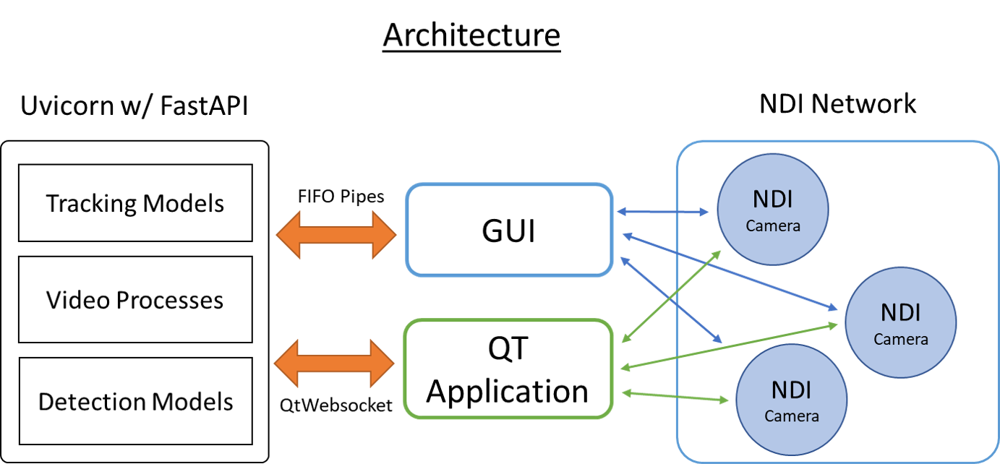

# NDI Auto Face Tracking
A Python framework to apply tracking and auto framing on NDI Video Streams

___

## Getting Started:
To use the project out of the box, install the python requirements using the requirements.txt file
```py
pip install -r requirements.txt
```
Run the FastAPI server in the background with:

```py
python TrackingServer_FastAPI.py
```
By default, the `uvicorn` server will run at `127.0.0.1:8000`. You can change this address using the `config.ini` file.

You can now run the Tracking GUI with:
```py
python TrackingGUI.py
```
___

## The library

### Network Architecture


### Tracking
The tracking module class `DetectionWidget` initiates a `Tracker` object.
This object abstracts 2 internal major objects. The `Object Detector` and `Object Tracker`. The *Object Detector* detects what the *Object Tracker* will track. Conventionally, object detection models are heavy and do not always detect the object. To solve this reliability issue, we employ an *Object Tracker* (default: CSRT Tracker) to do lighter weight tracking on detected objects

The default Object Detector relies on a fallback sequence of detecing a Face -> Body *(track_type = 0)*. Which means if we cant detect a face, try to detect a body. If the Object Detector uses multiple models detection models, you can set the `Tracker.track_type` property to set which which detection model to set priority to. 
```py
Tracker = DetectionWidget()
Tracker.track_type = 0 # default: Fall back sequence Model1 -> Model 2 -> Model 3
Tracker.track_type = 1 # Use Model 1 only (Face)
Tracker.track_type = 2 # Use Model 2 only (Body)
```
We rely on the brilliant [MTCCN](https://github.com/ipazc/mtcnn) Face Detector and a [TinyYolov4](https://github.com/AlexeyAB/darknet) Architecture Body Detector for the default Object Detector. You can create your own objects with different models

- **Tracking using Websockets**

To get camera tracking vectors using websockets, send a pickled `Image_Payload`. `Image_Payload` simply contains a pydantic model with `frame: bytes` as its field.
```
    #Get Video Frame
    retval, image = video.read()
    image = cv2.resize(image, resize_frame_shape)

    #Encode
    image_bytes = jpeg.encode(image)
    frame_payload = Image_Payload(frame = image_bytes)
    websocket.send_bytes(pickle.dumps(frame_payload))
```

- **Tracking using Qt Websockets**

To get camera tracking vectors using QWebsockets, send an `Image_Payload` encoded as a `QDataStream` with `QString('image')` appeneded at the start
```.py
#Prepare Datastream for Writing
content = QtCore.QByteArray()
writeStream = QtCore.QDataStream(content, QtCore.QIODevice.WriteOnly)

#Encode
image_bytes = jpeg.encode(image)
writeStream.writeQString('image')
writeStream << image_bytes

#Send
self.ws.sendBinaryMessage(content)
```

You will get a `JSON` response from the websocket:
```py
self.ws.textMessageReceived.connect(self.tracking_results) #connect a

@Slot(str)
def tracking_results(self, message):
    data = json.loads(message)
    print(f'Tracking results received: {data}')

{'x': int, 'y': int, 'w': int, 'h': int, 'x_velocity': float, 'y_velocity': float}
```
The `x,y,w,h` contains the bounding box the AI engine is tracking. `x_velocity, y_velcocity` are the commands to send to the camera to adjust it's position.

### API Endpoints:
We use the FastAPI framework and run a `uvicorn` server which external locally hosted applications can communicate with.
There are 2 main communication methods to achieve lightweight frame-by-frame streaming.

1. Websockets & Qt Websockets
2. FIFO / NamedPipes (TODO: Add Documentation) 

### Websockets:
`ws://127.0.1.1:8000/ws` exposes an endpoint that instructs the server to open a websocket.
You can connect to the websockets using python libraries. We suggest using the `websockets` package.
Using this endpoint also relies on the python `pickle` library to do encoding/decoding.


To get camera tracking vectors, send the `Image_Payload` pydantic model with a jpeg encoded object.
```py
from tool.payloads import Image_Payload
jpeg = TurboJPEG()

video = cv2.VideoCapture('test.mp4')                # Load a test mp4
ret, frame = video.read()                           # Retrieve frame from video
frame = cv2.resize(frame, (640, 360))               # Resize to minimum (suggested) dimensions
image_bytes = jpeg.encode(frame)                    # Encode the image into a jpeg using TurboLIB jpeg
frame_payload = Image_Payload(frame = image_bytes)  # Load into the Pydantic model
websocket.send_bytes(pickle.dumps(frame_payload))   # Send pickled image object over the websocket

```
You will get a `JSON` response:
```py
response = await websocket.receive_json()
print(response)
{'x': int, 'y': int, 'w': int, 'h': int, 'x_velocity': float, 'y_velocity': float}
```
The `x,y,w,h` contains the bounding box the AI engine is tracking. `x_velocity, y_velcocity` are the commands to send to the camera to adjust it's position.
> *Note*: The server has a user defineable(#TODO) FPS lock. Default is 15 FPS. The client can send as many frames to the endpoint but the server will only process and respond at 15 JSON FPS for each websocket connection.


#### Qt Websockets:
External applications can make use of the `ws://127.0.1.1:8000/qt_ws` endpoint.
You can connect to the websocket using the `QWebSocket` object of PySide2 / Qt framework.
Using this endpoint makes use of Qt objects to encode and decode on the server side.

Opening a Websocket on the client:
```py
self.ws = QtWebSockets.QWebSocket("",QtWebSockets.QWebSocketProtocol.Version13,None)
self.ws.open(QUrl("ws://127.0.0.1:8000/qt_ws"))
```


#### Setting Tracker Parameters (Python Pickling)
To set the Tracker's tracking parameters you, use the `Parameter_Payload` pydantic model.
Setting the tracker's parameters this way allows the user fine control to the `Tracker`'s parameters over `websockets`.
It is akin to using the `TrackingGUI.py`'s controls.

```py
from tool.payloads import Parameter_Payload
parameter_payload = Parameter_Payload(track_type=1, gamma=0.3, xMinE= 0.3)  # Set Custom Parameters
pickle_payload = pickle.dumps(parameter_payload)                            # Convert to a pickle object
websocket.send_bytes(pickle_payload)                                        # Send pickle object over the websocket
```

#### Setting Tracker Parameters with QT Websocket (Cross Platform)

To set the tracker's parameters, you send over an encoded `QDataStream` with `QString('parameter')` appeneded at the start
```py
 def send_paramaters_qt(self):
        # Prepare Datastream for Writing
        content = QtCore.QByteArray()
        writeStream = QtCore.QDataStream(content, QtCore.QIODevice.WriteOnly)

        # Build the paramater payload
        parameter_payload = Parameter_Payload(track_type=1, gamma=0.6, xMinE= 0.3) #Set customer parameters for the Tracker
        self.parameter_payload_loading(parameter_payload, writeStream)
        
        # Send custom Parameters
        self.ws.sendBinaryMessage(content)
        
def parameter_payload_loading(self, parameter_payload, writeStream):
    writeStream.writeQString('parameter') ## same as `writeStream << QString('parameter')
    for key, value in parameter_payload.__dict__.items():
        if isinstance(value, int):
            writeStream.writeInt32(value)
        elif isinstance(value, float):
            writeStream.writeFloat(value)
        elif isinstance(value, bool):
            writeStream.writeBool(value)
    return writeStream
```

### Tracking Parameters
You can view the `Parameter_Payload` structure in the `tool/payloads.py`
```
from pydantic import BaseModel
from config import CONFIG

class Parameter_Payload(BaseModel):
    target_coordinate_x: int = 320
    target_coordinate_y: int = 160
    track_type: int = 0
    gamma: float = ((CONFIG.getint('camera_control', 'gamma_default'))) / 10
    xMinE: float = ((CONFIG.getint('camera_control', 'horizontal_error_default'))) / 10
    yMinE: float = ((CONFIG.getint('camera_control', 'vertical_error_default'))) / 10
    zoom_value: float = 0.0
    y_track_state: bool = True
    autozoom_state: bool = True
    reset_trigger: bool = False
```
The `config.ini` file is also packaged with the Windows package so you can set some of the default parameters here.
Parameter_Payload has a field for `reset tracker`. This provides end-user a handle for restting the tracking object in cases of erroenous or undesired tracking. 
> *Note*: When sending the Parameter payload's reset tracker field to `True` at frame N, you must send another Parameter payload with the `reset_trigger` to false on frame N+1, or else the Tracker will be constantly resetting.

Sample `JSON` Response:
```
JSON{"target_coordinate_x": 320, "target_coordinate_y": 160, "track_type": 0, "gamma": 0.6000000238418579, "xMinE": 0.20000000298023224, "yMinE": 0.20000000298023224, "zoom_value": 0.0, "y_track_state": 1, "autozoom_state": 1, "reset_trigger": 0}
```

### About the Parameters:
- target_coordinate_x: The x-coordinate on where you want to keep the object on the frame. Default: center (320)
- target_coordinate_y: The y-coordinate on where you want to keep the object on the frame. Default: center (160)
- track_type: If model contains multiple models, track_type will indicate thefallback sequence of detection. e.g. Face -> Body. Default `(track_type = 0)`
- gamma: Camera movement dampener. Default: `0.6`
- xMinE: float: Allows for fine tuning of the horizontal tracking zone. By default, if the object displacement is 10% away from the `center`, the camera will be prompted to move. Default: `0.1`
- yMinE: float: Default = Same as in `xMinE` but for the vertical plane. Default: `0.1`
- zoom_value: Current Zoom Value. *Experimental:* For better tracking results in highly zoomed scenarios, providing the model with the current zoom value can immensel improve the tracking.) Please see [setting the zoom value]() on how to provide the proper zoom values
- y_track_state: Enable/Disable Vertical tracking. Default `True`
- autozoom_state: *Experimental:* If the target has been lost for 5 seconds, the camera will zoom out to try and retrieve the object again. Default `True`
- reset_trigger: Provides a user handle for restting the tracking object in cases of erroenous or undesired tracking. Default 'False'

> Note: When sending the Parameter payload's reset tracker field to `True` at frame N, you must send another Parameter payload with the reset_tracker to false or else the Tracker will be constantly resetting.


### Setting the zoom parameter: 
*Experimental*
The zoom level is a parameter directly tied to a camera's focal length.
Giving the tracking module the proper focal length of the camera allows finer movement control when under highly zoomed applications. As seen below, the `zoom_dict` is an interpolation between BirdDog's P200 camera focal length normalized from 0~10. Upon update `version = v1.1.4`, only the BirdDog's P200 focal length range is supported 
Feel free to give a pull reqest for the `zoom_dict` of other cameras.
```
def set_focal_length(self, zoom_level):
    """
    Range is 129mm to 4.3mm
    When Zoom Level is 0, it is = 129mm
    When Zoom level is 10, it is = 4.3mm
    Values in between might not be linear so adjust from there
    """
    zoom_dict = {0:129, 1:116.53, 2:104.06, 3:91.59, 4: 79.12,5:66.65, 6:54.18, 7:41.71, 8:29.24, 9:16.77, 10:4.3}
    self.focal_length = zoom_dict.get(int(zoom_level))
```


## Windows Executable package
The latest windows package can be downloaded [here](https://drive.google.com/file/d/17Za2NSWDfrS-XzKm_7pbGfeZtVEVwof1/view?usp=sharing).
Dependency: We use a super fast and lightweight external jpeg library to do byte->jpeg decoding.

Please install the library at: [TurboJPEG](https://libjpeg-turbo.org/)

The package comes with the `NDI_FaceTrack.exe` excutable.
Launching the `NDI_FaceTrack.exe` launches a `uvicorn` server in the background.
You can now run `TrackingGUI.exe` to get NDI PTZ Cameras video feeds and use auto tracking.
> Note: TrackingGUI.exe is broken on latest executable version (v1.1.3)
You can deploy the GUI with additional options using the terminal. `--help` 


## Tracking GUI

The following arguments allow customization of the launch parameters.
**Hotkeys** 

- Tracking Enable/Disable (Global) - Ctrl+Shift+ID e.g Ctrl+Shift+2
- Reset Tracking (Local) - Alt+R
- Move Camera (Local) - WASD
- Zoom Camera (Local) - QE

### Sample Launch

`TrackingGUI.exe --name "BDCAM1 (PTZ100)" --enable_console False --id 2`

### Arguments

`-n` `--name` Name: Use this option to connect directly to an NDI source upon launch. Provide the Name of the camera to connect to format: `NameXXX (DeviceXXX)` Default: `None`

`-c` `--enable_console` Interface: Use this option to hide the default interface. Default: `False`

 Warning: You must pass the `name` parameter when launching. |
 Warning: By using this option, you are unable to use any of the following features: |
    
- **Target X/Y COORD**: X and Y Position where the tracker will place the tracked person in reference to the frame. By default, the trcker will place the tracker person in the **CENTER** of the frame. 
- **Speed Sensitivity (Gamma)**: Control how fast the camera reacts to movement.
- **Horizontal Threshold**: The horizontal threshold on how far the target body is from the set tracking position (see Target X Coord). If the percentage is above the threshold, horizontal camera tracking will start.
- **Vertical Threshold**: The vertical threshold on how far the target body is from the set tracking position (see Target Y Coord). If the distance is above the threshold, vertical camera tracking will start.
- **Change sources**: Use the menu bar to select available NDI Sources
- **WASD QE keys**: Typically, we use WASD-QE keys to move and zoom the camera. This is disabled.

Vertical Tracking toggle and AutoFind toggle are also not useable during hidden UI mode.

`-l` `--logging` Logging: Use this option for debugging purposes. By enabling this option, you will generate a `debug.log` on the root directory which will contain debug information. This file may get excessively large so please delete after a debugging session. Default: `False`

`-i` `--id` ID: Launch the application with an associated ID. Use this ID to control the global hotkeys. 
Example: --id = 3; Ctrl+Shift+3 = Enable/Disable Tracking


