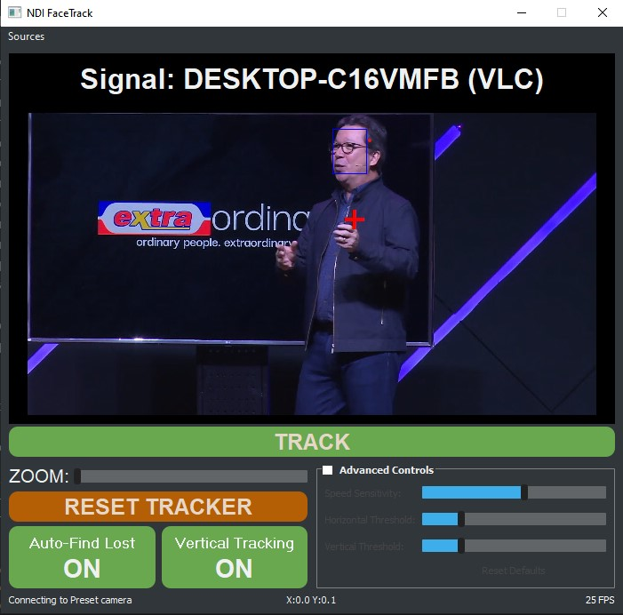

# NDI_FaceTrack
Python framework to apply tracking and auto framing on NDI Video Streams used for PTZ Cameras to automatically track persons of interests, freeing up camera operators. This application uses Machine Learning and CV Techniques to Identify and track both faces and human body figures.
> Note: Suggested NDI PTZ Cameras: BirdDog PTZ Line

This project also inlcudes a A Windows desktop application packaged with `pyinstaller`

NDI Facetracking uses open multiple open source projects to work seamlessly betwween each other, namely:

- A self-implemented state-of-the-art tracking algorithm based on the following paper: http://downloads.hindawi.com/journals/mpe/2019/9602460.pdf
- A robust and fast facial detection method using MTCNN: https://github.com/ipazc/
- OpenCV Object Trackers
- Custom Tiny Yolov4
- NDI C++  / Python Wrapper Library: https://github.com/buresu/ndi-python

https://gitlab.com/Tomas1337/NDI_FaceTrack

An integral part of this project is to have this easily deployable to users in a robust lightweight executable file.
Currently achieves +30FPS on an QuadCore Intel 2.4GHz

Update v1.14 - 03/23/2021

1. Improved documentation for websockets and tracking instructions

2. Minor bug fix in how JSON was sending as a response to the client.

Update v1.10 - 03/23/2021

1. Major Revision: Implented a FastAPI backend for communication with the Project's core tracking functionality. 

2. Tracking GUI: Tracking GUI now communicates with the FastAPI using namedPipes.

3. Websockets: Adds an API Endpoint to open up a websocket for communication with the Core Tracking Functionality

4. QT Websockets: Adds an API Endpoint to open up a websocket for communication with the Core Tracking Functionality using QWebSockets. This supports cross platform integration using QT

5. TODO: NamedPipes documentation

Update v1.03 - 01/26/2021

1. Fixed continous emitting of camera move signals. Now only emits signals during a tracking movement.

2. Added a universal hotkey for shutting down the application. Default shutdown hotkey is Ctrl+Shift+F{id}. Can be customized using config.ini file BirdDog Build Only.

5. Removed Alt+R as Reset button and switched to a universal hot key reset button. Default reset hotkey is Alt+Shift+{id}.

4. Disabled wasd-qe keys when console is disabled

5. Camera now reliably emits a stop signal during track off/on switching

Update v1.02 - 01/18/2021

1. Added online documentation hosted on gitlab pages
https://tomas1337.gitlab.io/NDI_FaceTrack/getting_started/

2. Added option for hiding the console using `--enable_console False`. This mode is not recommended for normal users.

3. Added parameter `id` upon launch which takes an integer. This is to assosicate an id to the launched application. Have only tested with id = [1,2,3]

4. Added a universal hotkey got enabling/disabling tracking. Default tracking hotkey is Ctrl+Shift+{id}

5. Added local hotkey of Alt+R which resets the application 

